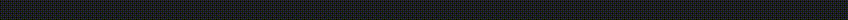

# Progress Printer - A console progress bar in Java

[](https://search.maven.org/search?q=g:%22io.github.NavjotSRakhra%22%20AND%20a:%22ProgressPrinter%22)
[](https://javadoc.io/doc/io.github.NavjotSRakhra/ProgressPrinter)

<!-- TOC -->
* [Progress Printer - A console progress bar in Java](#progress-printer---a-console-progress-bar-in-java)
  * [Introduction](#introduction)
  * [Preview](#preview)
  * [Project setup](#project-setup)
    * [Documentation](#documentation-)
  * [License](#license)
<!-- TOC -->

## Introduction

I needed a tool to display the process of training of my neural network. So I searched on GitHub and there were no simple
ones that I was able to find. The ones I found were incompatible with Windows hence I created one that uses simple 
ASCII characters to print the progress along with the progress percentage.

## Preview



## Project setup

The project is build using OpenJDK 11 and is compatible with Java 11+. It is available on Maven central and can be used
by entering the following into `<dependencies>` tag in maven
```xml
<dependency>
    <groupId>io.github.NavjotSRakhra</groupId>
    <artifactId>ProgressPrinter</artifactId>
    <version>1.0.0</version>
</dependency>
```
To use it create an instance of `ProgressPrinter` and update the process completion in fraction. Following is a sample code

```java
import io.github.NavjotSRakhra.progressPrinter.ProgressPrinter;

public class Sample {
    public static void main(String[] args) throws InterruptedException {
        ProgressPrinter progressPrinter = new ProgressPrinter();
        for (int i = 0; i < 100; i++) {
            progressPrinter.update(i / 99d);
            Thread.sleep(500);
        }
    }
}
```
### Documentation 

[Javadocs](https://javadoc.io/doc/io.github.NavjotSRakhra/ProgressPrinter/latest)

## License

MIT License

Copyright (c) 2023 Navjot Singh Rakhra

Permission is hereby granted, free of charge, to any person obtaining a copy
of this software and associated documentation files (the "Software"), to deal
in the Software without restriction, including without limitation the rights
to use, copy, modify, merge, publish, distribute, sublicense, and/or sell
copies of the Software, and to permit persons to whom the Software is
furnished to do so, subject to the following conditions:

The above copyright notice and this permission notice shall be included in all
copies or substantial portions of the Software.

THE SOFTWARE IS PROVIDED "AS IS", WITHOUT WARRANTY OF ANY KIND, EXPRESS OR
IMPLIED, INCLUDING BUT NOT LIMITED TO THE WARRANTIES OF MERCHANTABILITY,
FITNESS FOR A PARTICULAR PURPOSE AND NONINFRINGEMENT. IN NO EVENT SHALL THE
AUTHORS OR COPYRIGHT HOLDERS BE LIABLE FOR ANY CLAIM, DAMAGES OR OTHER
LIABILITY, WHETHER IN AN ACTION OF CONTRACT, TORT OR OTHERWISE, ARISING FROM,
OUT OF OR IN CONNECTION WITH THE SOFTWARE OR THE USE OR OTHER DEALINGS IN THE
SOFTWARE.
